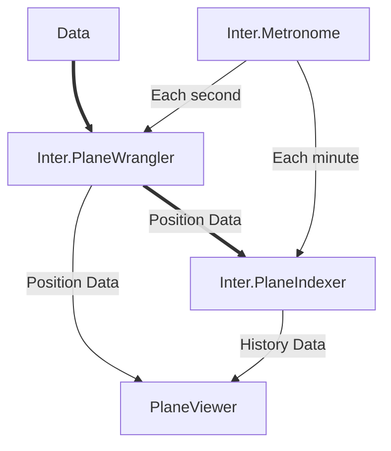

## Welcome!

This organization is an ongoing practice in software architecting and development.

More information on each service is available in their respective repository, linked below.

|Service Name| Description |
|-|-|
|[Inter.Metronome](https://github.com/InterMW/Inter.Metronome)| A service for triggering other services.|
|[Inter.PlaneWrangler](https://github.com/InterMW/Inter.PlaneWrangler)| A service for combining incoming data and providing current position data for consumption.|
|[Inter.PlaneIndexer](https://github.com/InterMW/Inter.PlaneIndexer) | A service providing past position data for consumption.|
