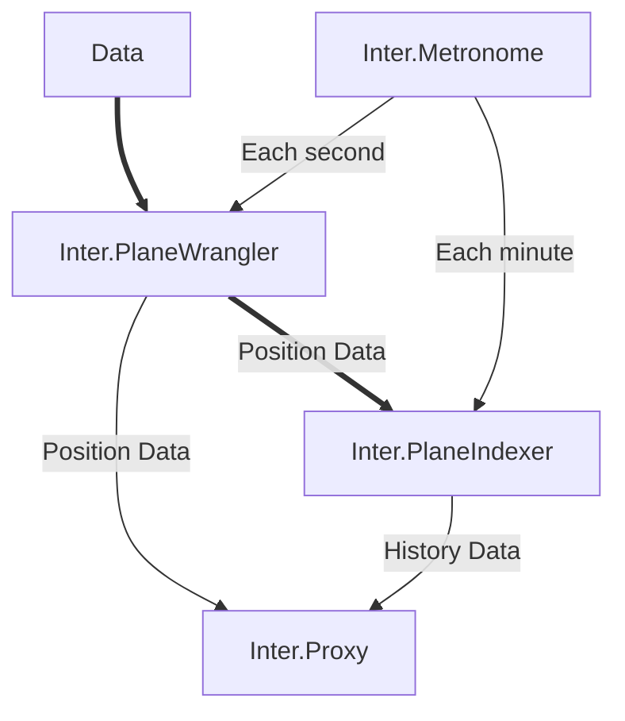
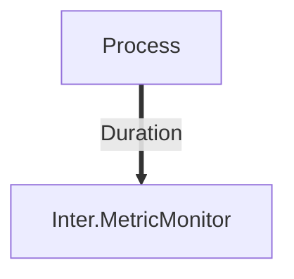
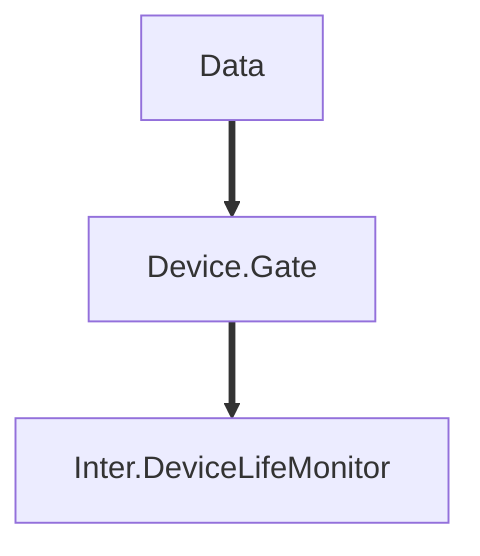

## Welcome!

This collection of repositories is owned by [Joseph Melberg](https://github.com/Joseph-Melberg) for the purpose of ongoing practice in software architecting and development.

## Plane Domain

More information on each service is available in their respective repository, linked below.

|Service Name| Description |
|-|-|
|[Inter.Metronome](https://github.com/InterMW/Inter.Metronome)| A service for triggering other services.|
|[Inter.PlaneWrangler](https://github.com/InterMW/Inter.PlaneWrangler)| A service for combining incoming data and providing current position data for consumption.|
|[Inter.PlaneIndexer](https://github.com/InterMW/Inter.PlaneIndexer) | A service providing past position data for consumption.|
|[Inter.Proxy](https://github.com/InterMW/Inter.Proxy)| A service that provides external access to the web api's of the other services.|

## Monitor Domain

|Service Name| Description|
|-|-|
|[Inter.MetricMonitor](https://github.com/InterMW/Inter.MetricMonitor)|More of a behind-the-scenes thing, allows us to monitor how long a given message takes to process.|

# Planned Domains
## Device Domain

|Service Name| Description|
|-|-|
|[Device.Gate](https://github.com/InterMW/Device.Gate)| The entry point for data for nodes.|
|[Inter.DeviceLifeMonitor](https://github.com/InterMW/Inter.DeviceLifeMonitor)| A service for monitoring the liveness of nodes.|

